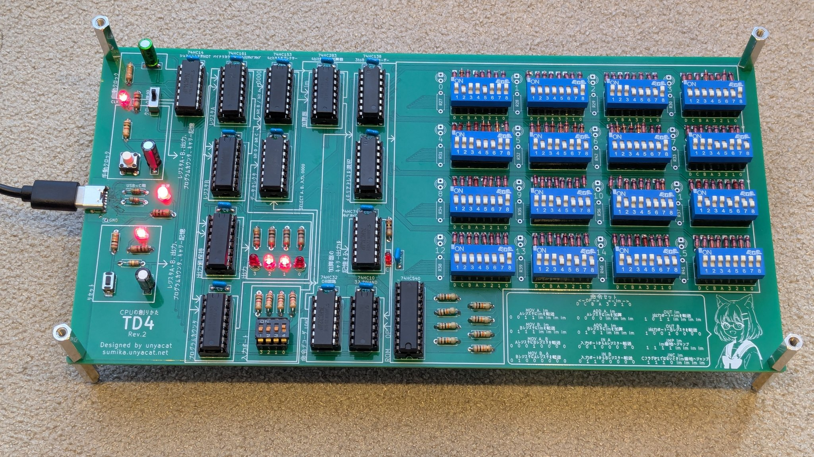
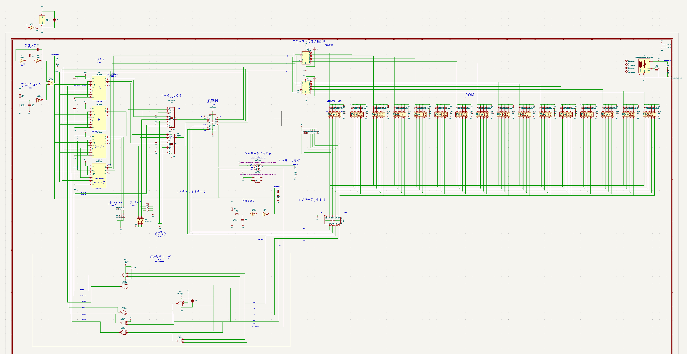
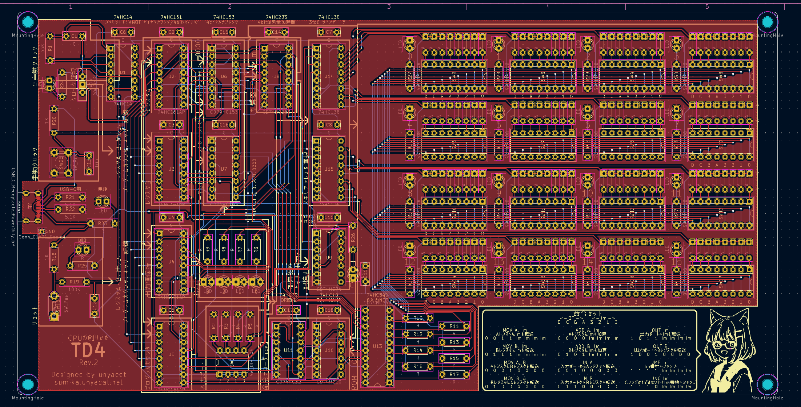

# TD4

渡波郁著 [CPUの創りかた](https://book.mynavi.jp/ec/products/detail/id=22065) 独自に起こした基板です。

## 必要な部品・値段

大まかの目安です。

|部品|個数|参考価格|内容|情報|
|---|---|---|---|---|
|74HC10|1|@60|3入力NAND回路||
|74HC14|1|@40|6回路シュミットトリガーインバータ||
|74HC32|1|@30|4回路OR||
|74HC74|1|@25|2回路Dフリップフロップ||
|74HC138|2|@30|3to8ラインデコーダ||
|74HC153|2|@180|4chマルチプレクサ||
|74HC161|4|@80|同期式4ビットカウンタ||
|74HC283|1|@220|4bit 2進全加算器||
|74HC540|1|@200|8bit 3ステートバッファ(反転タイプ)||
|USB Type-Cコネクタ|1|@70|電源供給用|[秋月](https://akizukidenshi.com/catalog/g/g116438/)|
|スライドスイッチ|1|@30|2.54mmピッチ|手動クロックと自動クロックを選択する用|
|0.1uF|14||積層セラミックコンデンサ|ICの近くに配置する用|
|10uF|3||無極性電解コンデンサ|自動クロック・手動クロック・リセット用|
|100Ω|8|||LED用|
|1kΩ|5||||
|5.1kΩ|2|||Type-Cから5V取る用|
|10kΩ|9||||
|33kΩ|1|||自動クロック用|
|100kΩ|1|||リセット回路用|
|LED|8||||
|DIPスイッチ 4P|1|@100||入力用|
|DIPスイッチ 8P|16|@110||ROM用|
|ICソケット 8P|1|10@100|||
|ICソケット 14P|4|10@120|||
|ICソケット 16P|25|10@180|||
|ICソケット 20P|1|10@170|||
|ダイオード|128|200@200|1S1588相当品|200個セットで購入|
|プッシュスイッチ|1||3.5mmピッチ|リセットボタン用|
|プッシュスイッチ|1||6mmピッチ角|手動クロック用|
|スペーサー|8|@50||四隅につけることができます|
|基板|1|5@3500||JLCPCB発注、送料込み|

## 既知の不具合

* ROM横のLEDの表示が反転しています。ROMが選択されていないときは点灯し、選択されているときは消灯します。
  * LEDにつながっているGNDを5Vに置き換えることで修正可能だと思われます。上の部品リストには含んでいません。

